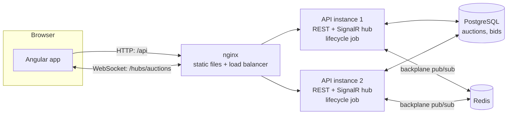

# Live Auction

A real-time auction platform where bidders see every new bid within a fraction of a second, competing bids on the same item are resolved fairly, and auctions close at exactly the advertised time.

## Why I built it

A simple auction site saves bids with a plain insert and makes users refresh the page to see the current price. That breaks in the final seconds of a popular auction: two people bid at the same moment and both think they won, the page shows a price that is already outdated, and bids arrive after the auction should have closed.

I built this project to learn how real-time systems handle that: pushing updates to many connected browsers over WebSockets, scaling those connections across several server instances, resolving concurrent writes to one hot row without locking everyone out, and running time-based state changes (auction close, anti-sniping extensions) reliably when the server, not the client, owns the clock.

It is the second project in my portfolio. [Payment Ledger](https://github.com/MadhavRaiTrivedi/payment-ledger) uses pessimistic row locks, RabbitMQ and a transactional outbox; this one deliberately uses the other tools: optimistic concurrency, SignalR with a Redis backplane, and `SKIP LOCKED` jobs running inside a horizontally scaled API.

Requirements: [docs/requirements.md](docs/requirements.md). Domain model and the bidding algorithm: [docs/domain-model.md](docs/domain-model.md).

## Demo

No hosted demo yet. Run it locally with `docker compose up --build` (see [Running locally](#running-locally)), open two browser windows, sign in as two different users, and bid against yourself. Screenshots and a GIF will be added here.

## Features

- Sellers create auctions with a starting price, an optional hidden reserve price, and start and end times, and can edit them until they go live
- Bidders see the price, bid history and countdown update live without refreshing
- Bid increments that grow with the price (₹10 up to ₹1,000, ₹50 up to ₹10,000, ₹100 above), set in configuration
- Automatic (proxy) bidding: set a maximum and the system bids for you, one increment at a time
- Anti-sniping: a bid in the last 30 seconds pushes the end time back to 30 seconds after that bid
- A private outbid notice on any page of the app
- Auctions start and close on time on the server; a bid after the end time is rejected even if the close job has not run yet
- Bidders appear under a per-auction alias such as `Bidder 3FA2C1`, so nobody can follow a person across auctions
- "My activity" page with auctions I am bidding on (leading, outbid, won, lost) and auctions I am selling
- Sellers can cancel an auction until the first bid; admins can cancel any open auction
- Per-user rate limit on bids
- Runs as two API instances behind nginx by default, sharing live connections through Redis

## Architecture



Each API instance is the same image. It serves the REST endpoints, hosts the SignalR hub, and runs the job that starts and closes auctions. PostgreSQL is the only source of truth. Redis only relays hub messages between instances; losing it loses no bids.

**How one bid flows through the system**

1. The browser sends `POST /api/auctions/{id}/bids` with an amount. nginx forwards it to any API instance.
2. The rate limiter checks the user's token bucket. The endpoint validates the body and calls `PlaceBidHandler`.
3. The handler loads the auction row (including PostgreSQL's `xmin` row version) and asks the `Auction` aggregate to resolve the bid. The aggregate checks status, end time and minimum bid, applies the proxy-bidding rules, may extend the end time, and returns the one or two bids it recorded.
4. EF Core saves the update with `WHERE id = @id AND xmin = @version` and inserts the bids, in one transaction. If another bid committed first, the update matches no rows; the handler reloads and resolves the bid again against the new price.
5. After the commit, the handler sends an `AuctionUpdated` message to the auction's hub group, and an `Outbid` message to the previous leader. Through the Redis backplane, every API instance forwards it to the watchers connected to it.
6. The HTTP response tells the bidder whether they lead. Every other watcher already has the new price from the hub.

When the browser opens an auction, it calls the hub's `Watch` method, which joins the auction's group and returns a snapshot. It does the same after every reconnect, so updates missed while offline do not matter.

## Tech stack

| Tool | Used for | Why this one | Alternatives considered |
|---|---|---|---|
| C# / .NET 10 | API, domain, background job | Same stack as my day job and my other project; first-class SignalR support | Node.js with Socket.IO |
| ASP.NET Core minimal APIs | REST endpoints | Little ceremony, built-in validation, ProblemDetails, rate limiting and OpenAPI | MVC controllers (more boilerplate for a small API) |
| ASP.NET Core SignalR | Pushing updates to browsers | Handles the WebSocket protocol, groups, per-user messages and reconnects; has a ready Redis backplane | Raw WebSockets (I would rebuild groups and reconnects), Server-Sent Events (one-way, no groups) |
| Redis | SignalR backplane | The standard scale-out for SignalR, simple pub/sub, nothing to persist | Azure SignalR Service (managed, not local), RabbitMQ (no built-in SignalR backplane) |
| PostgreSQL 17 | Auctions and bids | `xmin` gives a free row version for optimistic concurrency; `SKIP LOCKED` for the job; `pg_trgm` for title search | SQL Server (rowversion works too, but I wanted the PostgreSQL toolset) |
| EF Core 10 + Npgsql | Persistence and migrations | Row-version concurrency is built in; migration bundles run as a one-shot container | Dapper (would hand-write the concurrency checks) |
| Angular 22 | Frontend | Signals make live state simple; same framework as my other project | React |
| @microsoft/signalr | Browser hub client | Official client, automatic reconnect | Hand-written WebSocket client |
| nginx | Static files and load balancing across API replicas | One container serves the app and balances `/api` and `/hubs` with WebSocket upgrade | Traefik, YARP |
| OpenTelemetry + Aspire dashboard | Traces, metrics and logs locally | One exporter, a free local dashboard | Prometheus + Grafana (more containers) |
| xUnit v3, Shouldly | Backend tests | Readable assertions, `TestContext` cancellation | NUnit, FluentAssertions |
| Testcontainers | Integration tests against real PostgreSQL and Redis | Concurrency and `SKIP LOCKED` behaviour cannot be faked in memory | EF in-memory provider (no row versions, no locks) |
| Vitest | Frontend unit tests | Default runner in Angular 22, fast | Karma/Jasmine |
| k6 | Load test with thousands of WebSocket watchers | Scripts in JavaScript, built-in WebSocket support, runs in Docker | NBomber, Artillery |
| Docker Compose | Running everything locally | One command for the whole system including two API replicas | Running services by hand |
| GitHub Actions | CI | Free for public repos, Docker available for Testcontainers | Azure Pipelines |

## Project structure

```
src/
  LiveAuction.Domain/            Auction aggregate, Bid, increments, bidding rules. No framework references.
  LiveAuction.Application/       Use-case handlers, repository and notifier interfaces, options, metrics.
  LiveAuction.Infrastructure/    EF Core DbContext, configurations, migrations, repositories, telemetry setup.
  LiveAuction.Api/               Endpoints, SignalR hub and notifier, JWT and rate limiting, lifecycle job.
tests/
  LiveAuction.UnitTests/         Domain rules: bidding, proxy bidding, soft close, lifecycle, increments.
  LiveAuction.IntegrationTests/  HTTP and hub tests against PostgreSQL and Redis in Testcontainers.
frontend/                        Angular app, plus its Dockerfile and the nginx config that balances the API.
  src/app/auctions/              List, live auction page, create/edit form, state merging.
  src/app/realtime/              Hub connection service.
  src/app/activity/              My bids and my sales.
  src/app/auth/                  Development sign-in, session, interceptor, guard.
  src/app/shared/                Money formatting, server clock, countdown, error messages.
load-tests/                      k6 script: many watchers and a steady stream of bids on one auction.
docs/                            Requirements and domain model.
```

## Key concepts and patterns

**Aggregate with a transition table (State pattern, table form).** [Auction.cs](src/LiveAuction.Domain/Auctions/Auction.cs) owns every rule: status transitions live in one dictionary, and bids can only be placed through `PlaceManualBid` and `PlaceProxyBid`. Services never check `Status == ...` themselves.

**Proxy bidding.** The auction stores the leader's hidden maximum. A new offer is compared against it: if it does not beat it, the challenger's bid is recorded and the system immediately places an `Auto` bid for the leader one increment higher (capped at their maximum); if it does, the old leader's maximum is used up first. Ties go to the earlier bidder. The algorithm is written out in [domain-model.md](docs/domain-model.md#placing-a-bid) and covered in [BiddingTests.cs](tests/LiveAuction.UnitTests/Bidding/BiddingTests.cs).

**Optimistic concurrency on a hot row.** `Auction.Version` maps to PostgreSQL's `xmin` system column ([AuctionConfiguration.cs](src/LiveAuction.Infrastructure/Persistence/Configurations/AuctionConfiguration.cs)). [PlaceBidHandler.cs](src/LiveAuction.Application/Bidding/PlaceBidHandler.cs) retries on conflict, up to `Bidding:MaxConcurrencyAttempts`, re-resolving the bid against the new state. [UnitOfWork.cs](src/LiveAuction.Infrastructure/Persistence/UnitOfWork.cs) turns EF's exception into an application-level `ConcurrencyConflictException`, so the application layer does not depend on EF.

**Database as the last line of defence.** A unique index on `(auction_id, sequence)` ([BidConfiguration.cs](src/LiveAuction.Infrastructure/Persistence/Configurations/BidConfiguration.cs)) means two bids can never take the same position, even if the application check had a bug.

**Soft close (anti-sniping).** `ExtendIfClosing` in [Auction.cs](src/LiveAuction.Domain/Auctions/Auction.cs) moves `EndsAt` when a bid lands inside the window. Window and extension come from configuration.

**Server-owned time.** A bid is checked against `EndsAt` using the server clock at the moment it is resolved, so a bid after the end is rejected even before the close job flips the status. The browser never decides; [server-clock.ts](frontend/src/app/shared/server-clock.ts) only corrects the countdown display using the server time sent with every response.

**`FOR UPDATE SKIP LOCKED` job in every instance.** [AuctionRepository.cs](src/LiveAuction.Infrastructure/Auctions/AuctionRepository.cs) selects due auctions with `SKIP LOCKED`; [AuctionLifecycleJob.cs](src/LiveAuction.Api/Lifecycle/AuctionLifecycleJob.cs) runs it every second in each API instance. Instances share the work instead of repeating it, and no leader election is needed.

**SignalR groups and Redis backplane.** [AuctionHub.cs](src/LiveAuction.Api/Realtime/AuctionHub.cs) puts each watcher in an `auction:{id}` group. [RealtimeServiceCollectionExtensions.cs](src/LiveAuction.Api/Realtime/RealtimeServiceCollectionExtensions.cs) adds the Redis backplane when a Redis connection string is configured, so a message sent on one instance reaches watchers on all of them.

**Snapshot on watch, merge by bid count.** `Watch` joins the group first, then returns the current state, so an update committed in between is delivered rather than lost. The client ([live-auction-state.ts](frontend/src/app/auctions/live-auction-state.ts)) ignores any state with a lower bid count than what it already shows, which handles out-of-order delivery, duplicates after reconnect, and the race between the HTTP response and the hub message for your own bid.

**Notify after commit, best effort.** [SignalRAuctionNotifier.cs](src/LiveAuction.Api/Realtime/SignalRAuctionNotifier.cs) is called only after the transaction commits, and logs instead of failing if Redis is down. The bid is safe in PostgreSQL; watchers catch up from the snapshot when they reconnect.

**Dependency inversion.** The application layer defines `IAuctionRepository`, `IAuctionReader`, `IUnitOfWork` and `IAuctionNotifier`; Infrastructure and Api implement them. The domain project has no package references.

**Per-auction aliases.** [BidderAlias.cs](src/LiveAuction.Application/Bidding/BidderAlias.cs) hashes the auction id and bidder id, so history is readable ("Bidder 3FA2C1 outbid Bidder 81B07E") without exposing who anyone is, or linking one person's bids across auctions.

**Token bucket rate limiting.** [RateLimitingExtensions.cs](src/LiveAuction.Api/Http/RateLimitingExtensions.cs) gives each user a small burst for the last seconds of an auction and caps the sustained rate.

**Options pattern with startup validation.** Increment tiers, soft close timings and retry counts are bound to [BiddingOptions.cs](src/LiveAuction.Application/Bidding/BiddingOptions.cs) and validated at startup by [BiddingOptionsValidator.cs](src/LiveAuction.Application/Bidding/BiddingOptionsValidator.cs), so a bad tier table stops the app from starting instead of failing on the first bid.

## Design decisions and tradeoffs

| Decision | What I gave up | When I would choose differently |
|---|---|---|
| Optimistic concurrency (`xmin`) on the auction row | Under heavy contention on one auction, many attempts fail and retry, and after `MaxConcurrencyAttempts` the user gets a 409 | If a single auction regularly got hundreds of bids per second, I would serialise bids per auction (a single writer per auction via a partitioned queue, or `SELECT ... FOR UPDATE`) instead of retrying |
| Bids over HTTP, hub only pushes | One extra round trip compared with invoking a hub method | Never for bids; the HTTP path gives validation, ProblemDetails, rate limiting and simple tests |
| Lifecycle job inside each API instance | Job load scales with API replicas whether needed or not | With many instances or heavy jobs, a separate worker service with its own scaling |
| Polling every second instead of timers per auction | Up to one second of delay before the status flips (bids are still rejected on time) | Sub-second close notifications would need a delay queue or Redis keyspace notifications |
| WebSockets only, no negotiate request | No fallback to long polling for clients that block WebSockets | If corporate proxies were a concern, enable negotiate and use sticky sessions at the load balancer |
| PostgreSQL as the only source of truth, Redis only as backplane | Every read goes to PostgreSQL | Cache the auction snapshot in Redis if reads became the bottleneck |
| Offset pagination for the auction list | Pages shift if auctions are added while browsing | Keyset pagination on `(ends_at, id)` once the list gets large |
| Rate limits per API instance (in memory) | With N instances a user can send N times the limit | A Redis-backed distributed limiter |
| No idempotency keys on bids | A retried manual bid that already succeeded comes back as `AlreadyLeading` instead of the original response | Add `Idempotency-Key` handling as in Payment Ledger if clients retried automatically |
| Development token endpoint instead of a real identity provider | Not production authentication | Use an OpenID Connect provider (Entra ID, Auth0, Keycloak) |

## Challenges and how I solved them

**The configuration binder silently dropped a tier.** The first CI run failed every integration test at startup with "the last increment tier must have no upper limit", even though `appsettings.json` clearly had one. The tiers were bound straight into the domain record `BidIncrementTier(long? UpToInPaise, long IncrementInPaise)`. The binder could not construct that record for the element whose limit was `null`, and instead of failing it skipped the element, leaving two tiers. The startup validator I had added caught it, which is exactly why it exists. The fix binds to a plain settable class, [IncrementTierOptions.cs](src/LiveAuction.Application/Bidding/IncrementTierOptions.cs), and maps it to the domain record, which also keeps configuration concerns out of the domain.

**`SKIP LOCKED` made my own tests flaky.** Two integration tests failed in CI with a 409 where a 422 was expected, and with a missing outbid notice. The test helper ran the start job once and assumed its auction was now live. But test classes run in parallel and each runs the start job, so another class's job could be holding the row lock on my auction at that moment, and `SKIP LOCKED` correctly skipped it. The auction was still `Scheduled`, so the arrange-step bids failed without anyone noticing. The job was behaving as designed; the test assumed exclusive access. The helper now keeps running the job until its own auction is live ([LiveAuctions.cs](tests/LiveAuction.IntegrationTests/Infrastructure/LiveAuctions.cs)), and arrange-step bids assert success so a failure points at the real cause.

**Non-UTC times from clients.** Npgsql only writes `DateTimeOffset` values with a zero offset to `timestamptz`, so creating an auction with an Indian-time (`+05:30`) start time returned a 500. Request times are now converted to UTC at the boundary ([AuctionTermsRequest.cs](src/LiveAuction.Api/Auctions/AuctionTermsRequest.cs)), with an integration test that sends a `+05:30` time.

**Raw lock queries and the hidden row version.** The close job loads auctions with a raw `SELECT ... FOR UPDATE SKIP LOCKED`. `SELECT *` does not return PostgreSQL system columns, but EF needs `xmin` because it is mapped as the row version. The fix is `SELECT *, xmin FROM auctions ...` in [AuctionRepository.cs](src/LiveAuction.Infrastructure/Auctions/AuctionRepository.cs), with a comment so nobody "simplifies" it away.

**SignalR behind a round-robin load balancer.** The default client first sends a negotiate request and then opens the WebSocket. Behind a balancer without sticky sessions those two requests can reach different instances, and the connection fails. The client connects with `skipNegotiation: true` and WebSockets only ([auction-hub.ts](frontend/src/app/realtime/auction-hub.ts)), so a connection lives on whichever instance its single request reached.

**Missing updates between "load page" and "start watching".** If the page loads the auction over HTTP and then joins the hub group, a bid in between is lost. The hub joins the group before reading the snapshot, and the client merges by bid count, so the worst case is receiving the same bid twice, which is harmless.

**A close job that never runs exactly at the end time.** The job ticks every second, so for up to a second an auction is past its end but still `Live`. Instead of trying to make the job precise, the domain rejects any bid at or after `EndsAt` using the server clock ([Auction.cs](src/LiveAuction.Domain/Auctions/Auction.cs)), and an integration test checks it ([LifecycleTests.cs](tests/LiveAuction.IntegrationTests/Lifecycle/LifecycleTests.cs)).

**Equal proxy maximums.** When a challenger's offer equals the leader's maximum, the defending auto-bid has the same amount. I chose the eBay rule (earlier bid wins), which means amounts in the history never decrease but are not strictly increasing; the requirement was written to match.

## Performance and benchmarks

Not measured yet. The target from the requirements is 2,000 connected watchers on one auction and 200 bids per second, with p95 time from bid accepted to update received under 200 ms on a single developer machine.

How it will be measured: [load-tests/bidding.js](load-tests/bidding.js) creates an auction, ramps up to 2,000 WebSocket watchers over 20 seconds, then sends 200 bids per second for 60 seconds through nginx to two API replicas. Watchers speak the SignalR JSON protocol directly and record `now - bid.placedAt` for every bid they receive (`bid_broadcast_latency`). Rejected bids (arriving after a higher one) are expected and counted separately. The machine, dataset and results go here once it has run.

## Testing

**Backend unit tests** (38, [tests/LiveAuction.UnitTests](tests/LiveAuction.UnitTests)): manual and proxy bidding, ties, minimum bids, soft close, seller cannot bid, bids after the end time, lifecycle transitions, cancellation rules, increment tier validation, and a check that bid sequences are gap-free and amounts never decrease.

**Integration tests** (19, [tests/LiveAuction.IntegrationTests](tests/LiveAuction.IntegrationTests)), against PostgreSQL and Redis in Testcontainers through the real HTTP pipeline:

- 20 users bid the same amount at the same moment: exactly one succeeds
- 30 users bid rising amounts at once: the stored sequence is gap-free, amounts never decrease, the price equals the last bid
- Proxy bidding through the API, and the maximum stays hidden from others
- Close job running on two API instances at once closes each auction exactly once
- A bid after the end time is rejected before the close job runs
- Hub `Watch` returns a snapshot; a bid is pushed to watchers; the previous leader gets a private outbid notice
- Two API hosts sharing one Redis: a bid placed on one reaches a watcher connected to the other
- Reserve visible only to the seller, validation errors, search, ownership checks, cancellation rules, times sent with a non-UTC offset

**Frontend unit tests** (14, Vitest): state merging (stale and duplicate updates, late HTTP responses), server clock offset, countdown formatting, money conversion, session restore.

Run them:

```bash
# Backend unit tests
docker run --rm -v "$PWD":/src -w /src mcr.microsoft.com/dotnet/sdk:10.0 \
  dotnet test --project tests/LiveAuction.UnitTests

# Backend integration tests. They start their own PostgreSQL and Redis containers, so the SDK
# container gets the Docker socket and reaches those sibling containers through the host.
docker run --rm -v "$PWD":/src -w /src \
  -v /var/run/docker.sock:/var/run/docker.sock \
  --add-host=host.docker.internal:host-gateway -e TESTCONTAINERS_HOST_OVERRIDE=host.docker.internal \
  mcr.microsoft.com/dotnet/sdk:10.0 dotnet test --project tests/LiveAuction.IntegrationTests

# Frontend
docker run --rm -v "$PWD/frontend":/app -w /app node:24-bookworm-slim \
  sh -c "npm ci && npx ng test --watch=false"
```

CI ([.github/workflows/ci.yml](.github/workflows/ci.yml)) runs formatting checks, both test suites, the production frontend build and the Docker image builds on every push.

## Running locally

Prerequisites: Docker, Git.

```bash
cp .env.example .env        # optional; defaults work for local use
docker compose up --build
```

| URL | What |
|---|---|
| http://localhost:8080 | The app |
| http://localhost:8080/scalar | API reference (Scalar) |
| http://localhost:18888 | Aspire dashboard: traces, metrics, logs |

Sign in with the development sign-in (pick a role; leave the user id empty for a new user). Open a private window and sign in again to get a second user to bid against. Create an auction with a start time of now and an end time a few minutes away to see the countdown and the soft close.

Environment variables (see [.env.example](.env.example)):

| Variable | Default | Purpose |
|---|---|---|
| `POSTGRES_DB`, `POSTGRES_USER`, `POSTGRES_PASSWORD` | `live_auction`, `auction`, `auction` | Database |
| `JWT_SIGNING_KEY` | a local development key | Signs development tokens; at least 32 bytes |
| `API_REPLICAS` | `2` | Number of API instances behind nginx |

Bidding rules (increments, soft close, retry count), rate limits and the job interval are in [appsettings.json](src/LiveAuction.Api/appsettings.json) and can be overridden with environment variables such as `Bidding__SoftCloseWindow=00:01:00`.

Load test:

```bash
docker compose --profile load-test run --rm k6
```

There is no seed data; create auctions through the app or the API.

## API reference

The full OpenAPI document is at `/openapi/v1.json` and browsable at `/scalar`. All endpoints except the token endpoint need a bearer token.

| Method | Path | Purpose |
|---|---|---|
| `POST` | `/api/auth/dev-token` | Issue a development token for a role and optional user id |
| `GET` | `/api/auctions?search=&status=&page=` | Search auctions; default is live and upcoming |
| `POST` | `/api/auctions` | Create an auction |
| `GET` | `/api/auctions/{id}` | Auction details, including your alias, whether you lead and your maximum |
| `PUT` | `/api/auctions/{id}` | Edit a scheduled auction (seller only) |
| `POST` | `/api/auctions/{id}/cancel` | Cancel (seller before the first bid, admin any time while open) |
| `GET` | `/api/auctions/{id}/bids` | Bid history, newest first |
| `POST` | `/api/auctions/{id}/bids` | Place a bid: `{ "amountInPaise": 12000 }` |
| `POST` | `/api/auctions/{id}/proxy-bids` | Set a maximum: `{ "maxAmountInPaise": 50000 }` |
| `GET` | `/api/me/bids` | Auctions I bid on, with my standing |
| `GET` | `/api/me/auctions` | Auctions I am selling, with winner |
| `GET` | `/health/live`, `/health/ready` | Liveness and readiness |

Hub at `/hubs/auctions` (token in the `access_token` query parameter):

| Direction | Name | Payload |
|---|---|---|
| Client → server | `Watch(auctionId)` | Returns the current `AuctionUpdate` with the latest 20 bids |
| Client → server | `Unwatch(auctionId)` | |
| Server → client | `AuctionUpdated` | Price, minimum next bid, bid count, leader alias, end time, new bids, server time |
| Server → client | `Outbid` | Sent only to the bidder who lost the lead |

Errors are ProblemDetails with a `code` such as `BidTooLow`, `AlreadyLeading`, `AuctionEnded` or `SellerCannotBid`. Rule violations return 422, wrong-state errors 409, too many requests 429.

## Interview notes

### 30-second pitch

Live Auction is a real-time bidding app in .NET and Angular. Bids go in over HTTP and every watcher gets the new price over SignalR within milliseconds, even with two API instances, because they share messages through Redis. The hard part is the last seconds of an auction: concurrent bids are resolved with optimistic concurrency on PostgreSQL's row version, the server clock decides what is in time, late bids extend the auction, and a `SKIP LOCKED` job closes each auction exactly once no matter how many instances run it.

### 2-minute walkthrough

The `Auction` aggregate holds everything a bid needs: current price, leader, the leader's hidden maximum, bid count and end time. So a bid is one row update plus one or two inserted bid rows. That makes concurrency simple: the auction row's `xmin` is the version, EF adds it to the `WHERE` clause, and if another bid got there first, the handler reloads and re-resolves. A bid that was valid a millisecond ago may now be too low, which is the correct answer.

Proxy bidding lives in the domain. If you set a maximum, the system bids for you only as much as needed. When a challenger bids, the leader's maximum is compared; the loser's bid is still recorded so the history explains the price.

After the commit, the handler pushes an update to the auction's SignalR group. With two instances behind nginx, Redis forwards the message so every watcher gets it. Clients connect with WebSockets only and skip the negotiate request, so no sticky sessions are needed. On every connect or reconnect the client calls `Watch` and gets a snapshot; it merges by bid count so duplicates and out-of-order messages are harmless.

Time is server-owned. Bids are checked against the end time on the server clock, so the close job can lag a second without accepting late bids. The job runs in every instance and uses `FOR UPDATE SKIP LOCKED`; there is an integration test that runs it on two hosts at once.

### Likely questions

**Why optimistic and not pessimistic locking?** Bids are short, single-row writes, and a conflict is a natural moment to re-check the bid against the new price. My other project uses `SELECT ... FOR UPDATE`, so I wanted to show the other approach. The cost is wasted work under heavy contention on one auction; past a point I would serialise per auction instead.

**What happens if two people bid the same amount at the same instant?** Both read the same version. One update commits; the other's update matches zero rows, it reloads, sees the new price, and its bid is now below the minimum, so it gets a 422 `BidTooLow`. There is an integration test with 20 simultaneous identical bids.

**What if the API crashes mid-bid?** The update and the bid inserts are one transaction, so either both are stored or neither is. If it crashes after commit but before pushing to the hub, watchers miss one message; they still see the bid on their next update or reconnect snapshot, because PostgreSQL is the source of truth.

**What if Redis goes down?** Bids still work; they only touch PostgreSQL. Notifications from one instance stop reaching watchers on other instances. The notifier logs a warning instead of failing the request.

**How do you stop an auction closing twice with several instances?** The close query uses `FOR UPDATE SKIP LOCKED`, so a row one instance is closing is invisible to the others. Even if two instances saw it, the second `Close()` would throw `InvalidStatusTransition` and its transaction would roll back.

**How do you stop sniping?** Soft close: a bid inside the last 30 seconds moves the end time to 30 seconds after that bid. The new end time goes out with the update, so every countdown jumps.

**Why does the countdown use the server time?** The server decides when the auction ends. If a user's clock is two minutes slow, their countdown would be wrong. Every response carries the server time, the client keeps the offset, and the countdown uses `Date.now() + offset`.

**How does it scale?** Reads and connections scale by adding API instances; Redis fans out messages. The limit is writes to one hot auction row. Many different auctions scale fine because each has its own row.

**Why not put bids through the hub?** HTTP gives me validation, ProblemDetails, rate limiting and plain HTTP tests for free. The hub only pushes, which keeps it simple.

### Language and tool facts

- **`xmin` in PostgreSQL**: a system column holding the id of the transaction that last wrote the row. Npgsql maps a `uint` property marked `IsRowVersion()` to it. It is not returned by `SELECT *`.
- **EF Core concurrency**: a concurrency token is added to the `WHERE` of `UPDATE` and `DELETE`. If the affected row count is 0, EF throws `DbUpdateConcurrencyException`. After that, the tracked entities are stale; I clear the change tracker and reload.
- **`FOR UPDATE SKIP LOCKED`**: locks the selected rows and silently skips rows another transaction has locked. Common for job queues in PostgreSQL.
- **SignalR groups**: kept in memory per server. The Redis backplane publishes every group and user message to Redis; each server sends it to its local connections in that group.
- **SignalR user messages**: `Clients.User(id)` uses an `IUserIdProvider`; the default reads `ClaimTypes.NameIdentifier`, so I wrote one that reads the JWT `sub` claim.
- **JWT on WebSockets**: browsers cannot add an `Authorization` header to a WebSocket handshake, so the token goes in the `access_token` query string and `JwtBearerEvents.OnMessageReceived` reads it for the hub path only.
- **`PeriodicTimer`**: an async timer for `BackgroundService` loops; ticks do not overlap, and each tick here gets its own DI scope and DbContext.
- **ASP.NET Core rate limiting**: `AddRateLimiter` with a token bucket partitioned by user id; rejected requests return 429.
- **Angular signals**: the auction page state is a signal; `computed` derives the countdown and button states; the hub stream is an RxJS `Observable` cleaned up with `takeUntilDestroyed`.
- **Testcontainers**: starts real PostgreSQL and Redis containers once per test run; each test creates its own auctions, so tests run in parallel without cleanup.

## What I would do next

- Run the load test and record the numbers here
- Screenshots and a short GIF of two windows bidding against each other
- Distributed rate limiting through Redis, so the limit holds across instances
- Idempotency keys on bids, for clients that retry automatically
- Keyset pagination for the auction list
- Bid with the reserve in mind: let a proxy bid jump straight to the reserve when its maximum allows, as eBay does
- Item images (stored in object storage, not the database)
- A real identity provider instead of development tokens
- Hand the winner to checkout: place a hold for the final price through the Payment Ledger API
