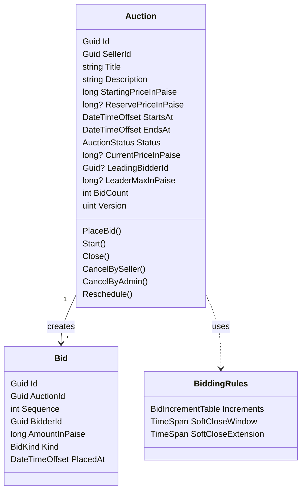
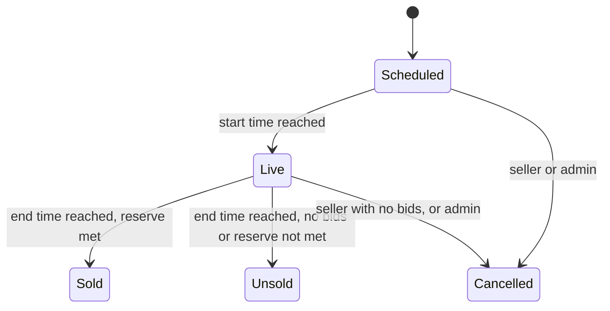

# Domain Model

This document describes the core types, the rules each one enforces, and how a bid is resolved. It is based on [requirements.md](requirements.md).

## Types

`Auction` is the aggregate root. Every rule about bidding reads or changes the auction row: current price, leader, leader's maximum, bid count and end time. So placing a bid is one update to one row plus one or two inserted bids, and the auction row is the only thing that needs concurrency control.

`Bid` rows are only ever inserted. `Sequence` is the auction's bid count at the time of the bid, and `(AuctionId, Sequence)` is unique in the database, so two bids can never claim the same position even if the application check were bypassed.

## Auction lifecycle

Transitions live in one table on `Auction`. Any other transition throws `DomainRuleViolationException` with `InvalidStatusTransition`.

- `Start(now)` requires `now >= StartsAt`.
- `Close(now)` requires `now >= EndsAt`. The result is `Sold` when there is a leader and the price meets the reserve, otherwise `Unsold`.
- A seller can edit (`Reschedule`) only while the auction is `Scheduled`.

## Bid increments

The minimum next bid is the starting price when there are no bids, otherwise the current price plus the increment for that price. Increments come from a tier table in configuration:

| Current price up to | Increment |
|---|---|
| ₹1,000 | ₹10 |
| ₹10,000 | ₹50 |
| above | ₹100 |

`BidIncrementTable` validates its tiers once (ascending limits, positive increments, last tier unbounded) so the domain can trust it.

## Placing a bid

There are two kinds of offer:

- **Manual bid** of amount `A`: the bidder wants a visible bid of exactly `A`.
- **Proxy bid** with maximum `M`: the bidder wants the system to keep them in the lead as cheaply as possible, up to `M`.

The auction keeps the leader's maximum in `LeaderMaxInPaise`. For a manual leader it equals the current price. Only the leader's maximum matters: any other bidder's maximum is already below the current price.

Checks for every offer: auction is `Live`, `now < EndsAt`, bidder is not the seller, and the offer (`A` or `M`) is at least the minimum next bid.

Resolution, with `L` the leader's maximum:

1. **No bids yet**: the bidder leads. A manual bid is placed at `A`; a proxy bid is placed at the starting price.
2. **Bidder already leads**: a manual bid is rejected (`AlreadyLeading`); a proxy bid raises `L` to `M` if `M > L`, without a visible bid.
3. **Offer beats `L`**: if `L` is above the current price, the old leader's proxy is used up and an `Auto` bid at `L` is recorded for them first. Then the new bidder leads: a manual bid at `A`, a proxy bid at `min(M, L + increment(L))`.
4. **Offer does not beat `L`**: the challenger's bid is recorded (manual at `A`, proxy at `M`, since that proxy is now used up), then an `Auto` bid for the leader at `min(L, offer + increment(offer))`. On a tie the leader keeps the lead, because their maximum was set first.

Each case records one or two bids. Amounts never go down, and the last recorded bid is always the leader's.

**Soft close**: if any bid was recorded and `now >= EndsAt - SoftCloseWindow`, `EndsAt` moves to `now + SoftCloseExtension`.

**Outbid**: when the leader changes, the auction raises `LeaderChanged` with the previous leader, so the application can notify them.

## Concurrency

`Auction.Version` maps to PostgreSQL's `xmin` system column, which changes on every update to the row. EF Core adds `WHERE xmin = @original` to the update. If another bid committed first, the update matches no rows, the handler reloads the auction and resolves the bid again against the new state, up to a configured number of attempts. A bid that was valid against the old price may now be too low, and is rejected with the reason.

The close job takes the opposite approach: it selects due auctions with `FOR UPDATE SKIP LOCKED`, so two API instances never close the same auction, and a bid in flight on that row makes the close job skip it until the next tick.

## Errors

Expected failures throw `DomainRuleViolationException` with a `DomainErrorCode`:

| Code | When |
|---|---|
| `InvalidAuctionSchedule` | End time not after start time, or start time in the past |
| `InvalidPrice` | Starting price not positive, reserve below starting price |
| `InvalidStatusTransition` | Lifecycle transition not in the table |
| `AuctionNotLive` | Bid on an auction that is not `Live` |
| `AuctionEnded` | Bid at or after `EndsAt` |
| `SellerCannotBid` | Seller bids on their own auction |
| `BidTooLow` | Offer below the minimum next bid |
| `AlreadyLeading` | Leader places a manual bid, or a proxy that does not raise their maximum |
| `AuctionHasBids` | Seller cancels a live auction with bids |
| `AuctionNotEditable` | Edit after the auction went live |
| `AuctionNotEnded` | Close before `EndsAt` |
| `AuctionNotStarted` | Start before `StartsAt` |
